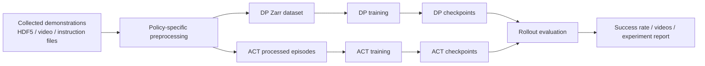

# RoboTwin Baseline Reproduction on RTX 4060 Ti 8GB

Reproduced and compared RoboTwin manipulation baselines on `beat_block_hammer`, including **Diffusion Policy (DP)** and **Action Chunking Transformer (ACT)**, with reproducible training commands, evaluation records, and result summaries under consumer-GPU constraints.

This repository is not meant to claim a new algorithm. Its role is to serve as a **structured embodied-policy experiment project**: training, inference, comparison, and documentation, done in a way that is honest, reproducible, and useful for later extension.

## Project Positioning

The most accurate description of this repo is:

**RoboTwin baseline reproduction and comparison under 8 GB GPU constraints.**

The machine used in these experiments has an `RTX 4060 Ti 8GB`, so the repository focuses on baselines that can be run reliably in that setting. Instead of trying to touch many policies superficially, the project currently goes deeper on two representative methods:

- `DP`: diffusion-based action prediction
- `ACT`: transformer-based action chunking

That scope is deliberate. The goal is to produce credible evidence, not a collection of half-finished runs.

## What This Repository Shows

- end-to-end RoboTwin baseline training and inference
- reproducible commands and run settings
- checkpoint and result tracking
- direct baseline comparison on the same task and data scale
- practical engineering decisions made under limited VRAM

## Pipeline



## Repository Structure

```text
experiments/
  dp/
  act/
  comparisons/
results/
  dp/
  act/
```

## Experiment Index

| Policy | Task | Setting | Checkpoint | Result | Report |
| --- | --- | --- | --- | --- | --- |
| `DP` | `beat_block_hammer` | `demo_clean`, 50 demos | `600.ckpt` | `33.0%` | [Report](experiments/dp/beat_block_hammer_demo_clean.md) |
| `ACT` | `beat_block_hammer` | `demo_clean`, 50 demos | `policy_best.ckpt` | `32.0%` | [Report](experiments/act/beat_block_hammer_demo_clean_b1.md) |

## Current Comparison

| Policy | Success Rate | Machine Adjustment | Main Note |
| --- | --- | --- | --- |
| `DP` | `33.0%` | reduced batch size to `8` | fit diffusion baseline to 8 GB VRAM |
| `ACT` | `32.0%` | reduced batch size to `1` | stable ACT baseline on the same machine |

Detailed comparison:
[DP vs ACT on `beat_block_hammer`](experiments/comparisons/beat_block_hammer_dp_vs_act.md)

## Key Observations

- On `beat_block_hammer` with `50` `demo_clean` demonstrations, `DP` and `ACT` ended up very close: `33.0%` vs `32.0%`.
- The result gap is small enough that this task and data scale should be treated as a **baseline comparison setting**, not as proof that one policy clearly dominates the other.
- Under `RTX 4060 Ti 8GB` constraints, the main engineering challenge was not collecting data but fitting training and evaluation safely into available VRAM.
- In this setup, careful scope control was more valuable than trying to add more policies without stable runs.

## Why Only ACT and DP Right Now

Due to the 8 GB VRAM limit of the local GPU, this repository currently focuses on `ACT` and `DP` as **reproducible and representative RoboTwin baselines**. The decision was to make a few baselines solid and comparable rather than expand to more policies that could not be trained or evaluated reliably on this hardware.

## What I Learned

- Reproduction quality depends as much on logging, checkpoint organization, and evaluation discipline as it does on launching training itself.
- Consumer-GPU constraints materially shape experiment design. Batch size, checkpoint layout, and evaluation wrappers become part of the project rather than invisible details.
- A public baseline repo becomes much stronger when it records not only the metric, but also the setup, scope boundary, and reasons behind engineering tradeoffs.

## Planned Next Upgrades

- add selected rollout GIFs or videos to the experiment pages
- add training-loss figures directly to the reports
- expand comparison notes with more qualitative observations
- add another task or another ACT/DP setting once the current baseline is fully documented

## Notes

This repository should be read as a growing **experiment project** rather than a final benchmark submission. The top-level README acts as an index; detailed run descriptions live under `experiments/`, and raw outputs are grouped under `results/`.
