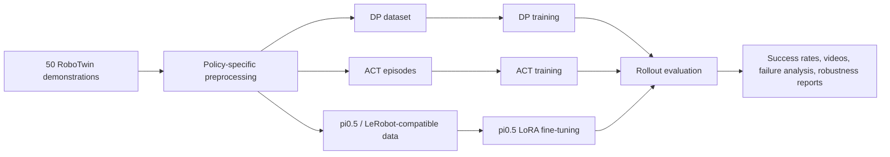

# RoboTwin Embodied Policy Benchmark and VLA Adaptation

This repository documents an end-to-end RoboTwin manipulation project on `beat_block_hammer`: first reproducing **Diffusion Policy (DP)** and **Action Chunking Transformer (ACT)** baselines under consumer-GPU constraints, then adapting the **pi0.5 vision-language-action model** with LoRA and evaluating it against those baselines.

The goal is not to claim a new algorithm. The goal is to show a credible robotics ML workflow: data preparation, policy training, checkpoint management, rollout evaluation, same-task comparison, robustness testing, and failure analysis.

## Highlights

- Reproduced DP and ACT baselines on an `RTX 4060 Ti 8GB` machine.
- Fine-tuned `pi05_base_aloha_lora` on 50 RoboTwin demonstrations using a `2x RTX 5090 32GB` cloud instance.
- Evaluated pi0.5 LoRA checkpoints at 5000 and 8000 training steps.
- Compared pi0.5 LoRA, DP, and ACT on the same RoboTwin task and seed stream.
- Added robustness tests for lighting, background/table texture, clutter, and combined randomization.
- Documented CUDA 12.8, SAPIEN/Vulkan, Torch/JAX, and cuRobo setup issues encountered on RTX 5090 hardware.

## Project Positioning

The most accurate description of this repo is:

**RoboTwin embodied-policy reproduction, benchmarking, and VLA adaptation under real GPU constraints.**

The project has two stages:

- `DP` and `ACT` baseline reproduction on `RTX 4060 Ti 8GB`
- pi0.5 LoRA adaptation and evaluation on `2x RTX 5090 32GB`

That scope makes the pi0.5 result more meaningful: it is not reported as an isolated success rate, but compared against reproduced baselines on the same task.

## Main Results

### Baseline Reproduction

| Policy | Task | Setting | Checkpoint | Result | Report |
| --- | --- | --- | --- | --- | --- |
| `DP` | `beat_block_hammer` | `demo_clean`, 50 demos | `600.ckpt` | `33.0%` | [Report](experiments/dp/beat_block_hammer_demo_clean.md) |
| `ACT` | `beat_block_hammer` | `demo_clean`, 50 demos | `policy_best.ckpt` | `32.0%` | [Report](experiments/act/beat_block_hammer_demo_clean_b1.md) |

Detailed baseline comparison:
[DP vs ACT on `beat_block_hammer`](experiments/comparisons/beat_block_hammer_dp_vs_act.md)

### pi0.5 LoRA Adaptation

| checkpoint | instruction split | success | trials | success rate | Report |
| --- | --- | ---: | ---: | ---: | --- |
| `checkpoint-5000` | unseen | 34 | 100 | 34.0% | [Report](experiments/pi05_lora/beat_block_hammer_pi05_lora.md) |
| `checkpoint-8000` | unseen | 45 | 100 | 45.0% | [Report](experiments/pi05_lora/beat_block_hammer_pi05_lora.md) |
| `checkpoint-5000` | seen | 15 | 50 | 30.0% | [Report](experiments/pi05_lora/beat_block_hammer_pi05_lora.md) |
| `checkpoint-8000` | seen | 27 | 50 | 54.0% | [Report](experiments/pi05_lora/beat_block_hammer_pi05_lora.md) |

The 8000-step LoRA checkpoint outperformed the 5000-step checkpoint on both seen and unseen instruction splits.

### Same-Seed Policy Benchmark

| Policy | Model / Checkpoint | Success | Trials | Success Rate | Status |
| --- | --- | ---: | ---: | ---: | --- |
| pi0.5 LoRA | `checkpoint-8000` | 45 | 100 | 45.0% | complete |
| Diffusion Policy | `600.ckpt` | 26 | 100 | 26.0% | complete |
| ACT | `policy_last.ckpt` | 13 | 46 | 28.3% | paused partial |

The same-seed benchmark is documented in:
[Robustness and Same-Seed Benchmark](experiments/pi05_lora/robustness_and_same_seed_benchmark.md)

### pi0.5 Robustness Snapshot

| Setting | Success | Trials | Success Rate |
| --- | ---: | ---: | ---: |
| clean | 45 | 100 | 45.0% |
| lighting randomization | 25 | 50 | 50.0% |
| background/table texture randomization | 19 | 50 | 38.0% |
| clutter randomization | 26 | 50 | 52.0% |
| background + lighting + clutter | 15 | 50 | 30.0% |

## Pipeline



## Repository Structure

```text
experiments/
  dp/
  act/
  comparisons/
  pi05_lora/
docs/
  pi05_lora/
results/
  dp/
  act/
  pi05_lora/
scripts/
```

Important pi0.5 documents:

- [pi0.5 LoRA experiment report](experiments/pi05_lora/beat_block_hammer_pi05_lora.md)
- [Robustness and same-seed benchmark](experiments/pi05_lora/robustness_and_same_seed_benchmark.md)
- [pi0.5 reproduction notes](docs/pi05_lora/reproduction.md)
- [RTX 5090 runbook](docs/pi05_lora/robotwin_pi05_5090_32g_runbook.md)
- [Failure analysis notes](docs/pi05_lora/failure_analysis.md)
- [Resume material](docs/pi05_lora/resume_material.md)

## Evidence

- DP and ACT were trained end-to-end and evaluated on `100` unseen-instruction episodes.
- pi0.5 LoRA was trained to `8000` steps and evaluated across seen/unseen instruction splits.
- Robustness evaluations changed lighting, background/table texture, clutter, and combined randomization.
- Rollout videos and failure manifests were generated locally; large videos, raw datasets, checkpoints, credentials, and model weights are intentionally excluded from this public repo.

## Key Observations

- DP and ACT were close under the original 8 GB baseline setting: `33.0%` vs `32.0%`.
- pi0.5 LoRA reached `45.0%` on the same task under the same primary seed stream, outperforming the reproduced DP baseline.
- The jump from `checkpoint-5000` to `checkpoint-8000` shows that the LoRA run was still benefiting from additional optimization.
- Background/table texture randomization was more damaging than lighting or clutter alone in this run.
- ACT evaluation on the RTX 5090 setup needed watchdog logging because some rollouts stalled; the partial result is reported honestly rather than silently discarded.

## What This Project Demonstrates

- End-to-end robotics ML experiment execution rather than only model training.
- Reproducible evaluation discipline: fixed seeds, checkpoint comparison, seen/unseen instruction splits, and explicit partial-run accounting.
- Practical GPU engineering across limited local hardware and larger cloud hardware.
- Honest benchmark reporting with raw-result summaries and caveats instead of only best-case metrics.

## Notes

This repository should be read as a growing public experiment archive rather than a final benchmark submission. It intentionally excludes raw demonstrations, model weights, large rollout videos, cloud cache directories, and credentials.
